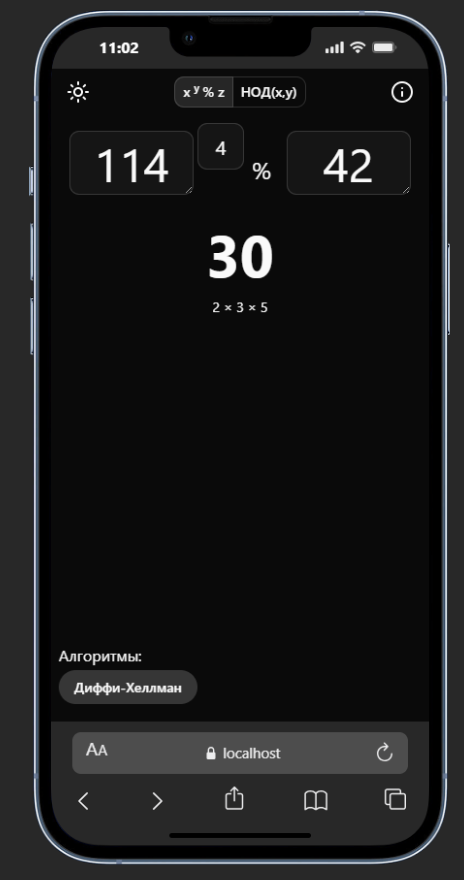
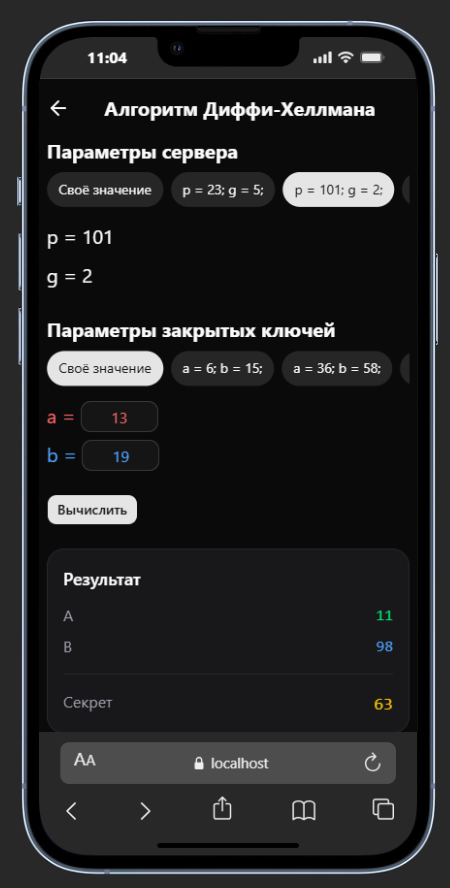

# Cryptocalc

**Cryptocalc** — это простое mobile-first приложение для вычисления базовых криптографических операций на TS.  

---

## 🚀 Функционал

- Переключение тем
- Вычисление НОД
- Вычисление чисел с большими степени по модулю
- Вычисление секретного ключа по алгоритму Диффи-Хеллмана
- Адаптивный дизайн для разных устройств
- Модульные и UI тесты

---

## 🛠️ Основные зависимости

### Frontend:

- **TypeScript** 
- **shadcn**
- **Tailwind** 
- **Vitest**


## 📦 Установка и запуск (Frontend)

1. **Клонируйте репозиторий:**
   ```bash
   git clone https://github.com/AlexShatokhin/cryptocalc.git
   cd cryptocalc
  ``

2. **Установите зависимости:**
   ```bash
    npm install
  ``


3. **Запустите клиент в режиме разработки:**
   ```bash
    npm run dev
  ``

## Демо
https://alexshatokhin.github.io/cryptocalc/dist/

## 🖼️ Скриншоты и видео





